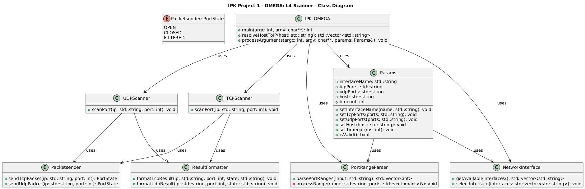

# IPK OMEGA - L4 Scanner

## Obsah
1. [Úvod](#1-úvod)  
2. [Architektura řešení a souborová struktura](#2-architektura-řešení-a-souborová-struktura)  
3. [Shrnutí teoretických znalostí](#3-shrnutí-teoretických-znalostí)  
4. [UML diagram](#4-uml-diagram)  
5. [Testování a validace](#5-testování-a-validace)  
6. [Sestavení](#6-sestavení)  
7. [Příklad použití](#7-příklad-použití)  
8. [Bibliografie](#8-bibliografie)  


## 1. Úvod
Tato dokumentace popisuje realizaci projektu **IPK OMEGA - L4 Scanner**, který provádí skenování TCP a UDP portů na zadaných IPv4 nebo IPv6 adresách. Cílem bylo implementovat rychlý a efektivní nástroj, který odhalí stav portů: `open`, `closed` nebo `filtered`.

## 2. Architektura řešení a souborová struktura

### 2.1 Hlavní soubor
- `IPK_OMEGA.cpp`: Zpracovává argumenty, validuje vstupy, volá funkce pro TCP a UDP scan.

### 2.2 Pomocné tříy
- `Params.h/cpp`: Ukládá a validuje parametry.  
- `NetworkInterface.h/cpp`: Vypisuje dostupná rozhraní (IPv4 + IPv6).  
- `PortRangeParser.h/cpp`: Zpracování portů a jejich rozsahů, validace hodnot.

### 2.3 TCP/UDP Scan
- `TCPscanner.h/cpp`: Volá `Packetsender::sendTcpPacket()` a formátuje výsledek.  
- `UDPscanner.h/cpp`: Volá `Packetsender::sendUdpPacket()`.  
- `Packetsender.h/cpp`: Implementace vlastního skenování, analýza `errno`, detekce `FILTERED` u TCP, `recvmsg(MSG_ERRQUEUE)` pro UDP.

### 2.4 Ostatní
- `ResultFormatter.h/cpp`: Jednotný výstup na stdout dle zadání (IP PORT PROTOCOL STATE)

## 3. Shrnutí teoretických znalostí

### TCP SYN skenování
TCP SYN scan využívá vlastnosti třícestného navazování spojení (three-way handshake). Místo kompletního spojení však aplikace odešle pouze SYN paket. Reakce na tento paket určí stav portu:
- Odpověď SYN+ACK znamená, že je port otevřený (`open`)  
- Odpověď RST znamená, že je port uzavřený (`closed`)  
- Žádná odpověď nebo blokace znamená `filtered`

### UDP skenování
UDP je bezspojový protokol a běžně neodpovídá na pakety. Stav portu se určuje:
- ICMP zpráva typu 3, kód 3 znamená `closed`  
- Žádná odpověď → interpretace jako `open` nebo `filtered`

### Implementace
- UDP: `recvmsg()` s `MSG_ERRQUEUE`  
- TCP: analýza `connect()` a `errno`

## 4. UML diagram





## 5. Testování a validace
Testováno na Ubuntu 22.04 s jádrem 5.15. Provedeny následující testy:

### Test TCP skenování
```bash
./ipk-l4-scan -i lo -t 22 127.0.0.1
# Očekávaný výstup: 127.0.0.1 22 tcp open
sudo ss -tlnp | grep :22
```

### Test UDP skenování
```bash
./ipk-l4-scan -i lo -u 123 ::1
# Očekávaný výstup: ::1 123 udp open
# Pomocí: nc -6 -u -l 123
```

### TCP filtered test
```bash
sudo iptables -A INPUT -p tcp --dport 4444 -j DROP
./ipk-l4-scan -i lo -t 4444 ::1
# Výstup: ::1 4444 tcp filtered
```

### Porovnání s nmap
```bash
nmap -p 22 127.0.0.1
# Očekávaný výstup: 22/tcp open ssh
```

### Test IPv6
- Otestováno pomocí https://test-ipv6.com – zařízení nemělo veřejnou IPv6 adresu.
- Testováno pouze na `::1`:
```bash
./ipk-l4-scan -i lo -t 80 ::1
# Výstup: ::1 80 tcp closed
```


---

## 6. Sestavení
Program lze zkompilovat pomocí příkazu:

```bash
make
```

Pro vyčištění sestavení (smazání `.o` souborů a binárky):

```bash
make clean
```

## 7. Spuštění
```bash
./ipk-l4-scan [-i interface] [--pt tcp-porty] [--pu udp-porty] [-w timeout] [hostname|IP]
```

| Argument           | Popis                                                              |
|--------------------|---------------------------------------------------------------------|
| `-i`, `--interface`| Určí síťové rozhraní pro skenování                        |
| `-t`, `--pt`       | TCP porty ke skenování (např. `22,80`, `20-25`)                |
| `-u`, `--pu`       | UDP porty ke skenování                                           |
| `-w`, `--wait`     | Timeout v ms (např. `3000`, výchozí je `5000`)                  |
| `hostname`, `IP`   | Cílové zařízení ke skenování                             |

## Příklad použití
```bash
./ipk-l4-scan -i lo -t 21,22 -u 53,67 localhost
./ipk-l4-scan -i wlp3s0 -t 80 www.fit.vutbr.cz
./ipk-l4-scan -i lo -t 9999 -w 1000 127.0.0.1
./ipk-l4-scan --interface
```
## 8. Bibliografie
- [RFC 793] Transmission Control Protocol – https://www.ietf.org/rfc/rfc793.txt  
- https://sites.uclouvain.be/SystInfo/usr/include/netinet/ip_icmp.h.html  
- https://pubs.opengroup.org/onlinepubs/7908799/xns/arpainet.h.html  
- https://svn.nmap.org/nmap/docs/nmap.usage.txt  
- https://nmap.org/  
- https://man7.org/linux/man-pages/man2/recvmsg.2.html  
- https://pubs.opengroup.org/onlinepubs/009695199/basedefs/netdb.h.html  
- https://dev.to/b0r/nmap-go-implementation-tcp-port-scan-179b  
- https://test-ipv6.com/  
- https://www.siteground.com/kb/ipv4-vs-ipv6/  
- https://how.dev/answers/how-to-implement-tcp-sockets-in-c  
- https://man7.org/linux/man-pages/man3/inet_ntop.3.html  
- Learning Kali Linux: TCP, UDP and ICMP Scanning - https://www.youtube.com/watch?v=AY5jeXV3w6Q
- Nmap - UDP Scanning - https://www.youtube.com/watch?v=FOy7rkI5IWg
- NMAP Basics Tutorial for Kali Linux Beginners - https://www.youtube.com/watch?v=W7076RPIgfQ

